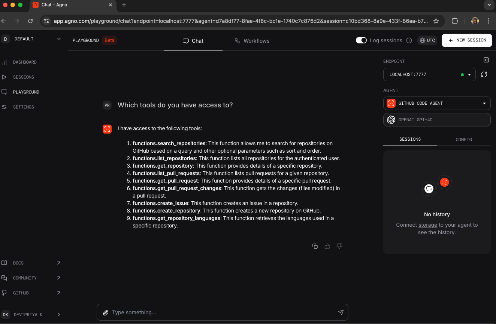
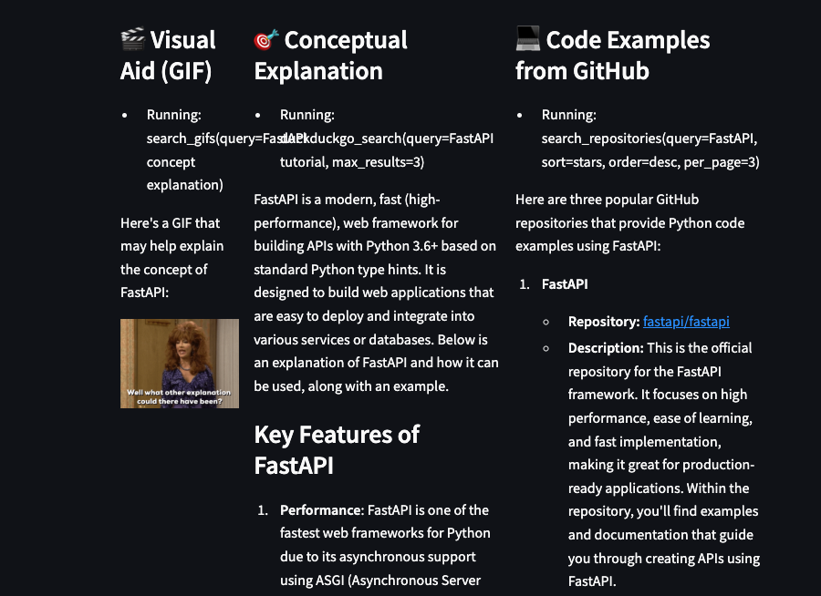

# AGNO Multi-Agent System Demo
This demo showcases a multi-agent system built with the AGNO framework, integrating web search, GitHub code search, and GIFs via Streamlit and a local UI.

## Overview
The project includes:
1. **Multi-Agent System Implementation**
2. **Streamlit Web Application**
3. **Local AGNO Playground Interface**

## Project Structure
agno_usecase/
├── python_withgif.py    # Core agent implementation
├── app.py               # Streamlit web interface
├── playground.py        # AGNO's local UI interface
├── .env                 # Environment variables
├── requirements.txt     # Python dependencies
└── README.md            # Project documentation


## Components

### 1. Multi-Agent System (python_withgif.py)
The core agents include:
- **Web Agent**: DuckDuckGo web search
- **GitHub Code Agent**: GitHub code search
- **Giphy Agent**: GIF integration

### 2. AGNO Playground (playground.py)
- Local testing interface for agents
- Debugging, tool monitoring, and agent behavior verification



### 3. Streamlit App (app.py)
- Interactive chat interface
- Real-time responses with text, code, and GIFs
- User-friendly input and response history




## Steps:
1. Set up a virtual environment 
`conda create -p venv python==3.12`

2. Install dependencies with `pip install -r requirements.txt`

3. Set up your env variables in .env file

4. Run python_withgif.py file to understand overall logic, playground1.py to debug and app.py for final streamlit UI 


## Running the Applications
```bash
python python_withgif.py
streamlit run app.py
python playground.py


